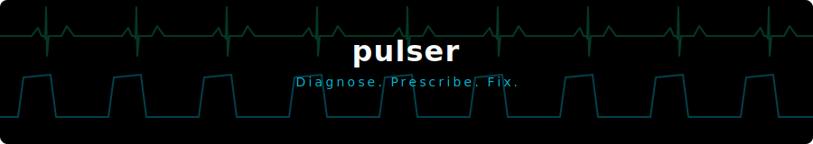

# pulser

<p align="center">
  
</p>

<p align="center">
  <a href="https://whynowlab.github.io/pulser/">Website</a> ·
  <a href="https://www.npmjs.com/package/pulser-cli">npm</a> ·
  <a href="./README.ko.md">한국어</a>
  <br><br>
  <a href="https://www.npmjs.com/package/pulser-cli"></a>
  <a href="https://github.com/whynowlab/pulser/blob/main/LICENSE"></a>
</p>

"Check my skills." Diagnose, classify, prescribe, and fix — without leaving the conversation.

```
$ pulser

  pulser v0.3.1

  54 skills scanned · Score: 89/100
  ✓ 48 healthy  ⚠ 4 warnings  ✗ 2 errors

  Top issues:
    cardnews    — No Gotchas, no allowed-tools
    geo-audit   — 338 lines, single file

  💊 Rx #1 — cardnews
  [GOTCHAS] Add Gotchas section
    Why: Anthropic's highest-ROI improvement
    Template:
      ## Gotchas
      1. Validate output against conventions
      2. Check scope — don't over-generate

  Fix type: AUTO
```

## What it does

pulser scans your `SKILL.md` files against 8 diagnostic rules derived from Anthropic's published principles in ["Building Claude Code: How We Use Skills"](https://code.claude.com/docs/en/skills):

| Rule | What it checks |
|------|---------------|
| `frontmatter` | Required `name` and `description` fields |
| `description` | Trigger keywords, "Use when" pattern, length |
| `file-size` | SKILL.md under 500 lines |
| `gotchas` | Gotchas section with failure patterns |
| `allowed-tools` | Tool restrictions appropriate for skill type |
| `structure` | Supporting files for large skills |
| `conflicts` | Trigger keyword overlap between skills |
| `usage-hooks` | Skill usage logging hook installed |

Each skill is auto-classified by type (analysis, research, generation, execution, reference) with confidence scoring. Prescriptions are tailored to the detected type.

## Install

```bash
npm install -g pulser-cli
```

On install, pulser registers itself as a Claude Code skill — say "check my skills" or `/pulser` to run it conversationally.

## Usage

### In Claude Code

Just say it:

```
check my skills
```

Or use the slash command:

```
/pulser
```

Claude runs the diagnosis, summarizes results, and offers to fix issues — all within the conversation.

### In terminal

```bash
# Scan default path (~/.claude/skills/)
pulser

# Scan a specific directory
pulser ./my-skills/

# Scan a single skill
pulser --skill reasoning-tracer

# Auto-fix issues with backup
pulser --fix

# Rollback the last fix
pulser undo

# JSON output (for CI/automation)
pulser --format json

# Markdown report
pulser --format md

# Treat warnings as errors
pulser --strict

# Disable TUI animation
pulser --no-anim
```

## Core Pipeline

1. Diagnose — Scan and classify issues across 8 rules
2. Prescribe — Explain why it matters, provide ready-to-use templates
3. Fix — Auto-apply safe structural fixes with full backup
4. Rollback — Instant undo, your safety net

## Exit Codes

| Code | Meaning |
|------|---------|
| `0` | All rules passed |
| `1` | Errors found |
| `2` | Warnings found (with `--strict`) |

## Patient Monitor TUI

When running in a TTY terminal, pulser displays a hospital-style patient monitor with real-time waveform animation:

- Green ECG — Skills being scanned
- Green capnography — Pass/warn/fail counts
- Cyan plethysmograph — Health score
- Yellow respiratory — Prescription count

Disable with `--no-anim` or pipe to a file.

## License

MIT — [whynowlab](https://github.com/whynowlab)
